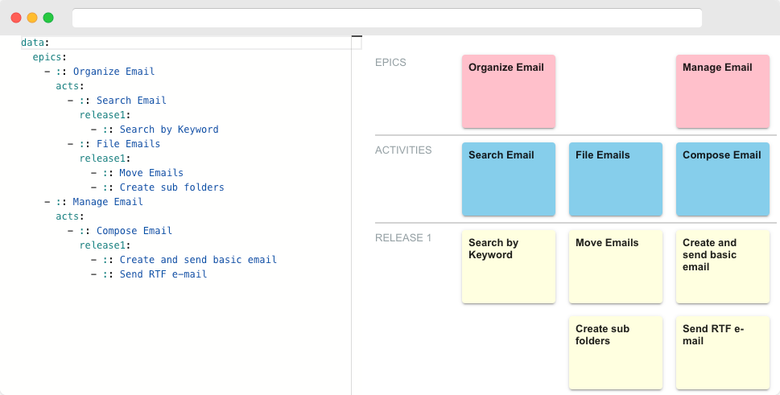

# YAML STICKY NOTES

## Overview

YAML STICKY NOTES is a simple tool for visualizing and managing your ideas. It's handy for creating user story maps, organizing ideas, and managing tasks.

## Features

- **Just YAML**: Focus on your ideas with simple operations that anyone can use easily.
- **Version Control**: Integrated with Git, you can manage history.
- **Ease of Editing**: With a text-based format, adding, deleting, and rearranging items is easy.

## License

MIT License
